# Screenshots

Every shot, in the order of a session: manage your bank and the shared templates, build
the quiz and its media, open the lobby, players join, questions, reveals, podium — then the
administration of the instance's media. The README shows a selection of twelve.

The media in these shots are free-licensed photos, video and sounds from Wikimedia Commons,
credited in the app as each licence asks.

| | |
|---|---|
| 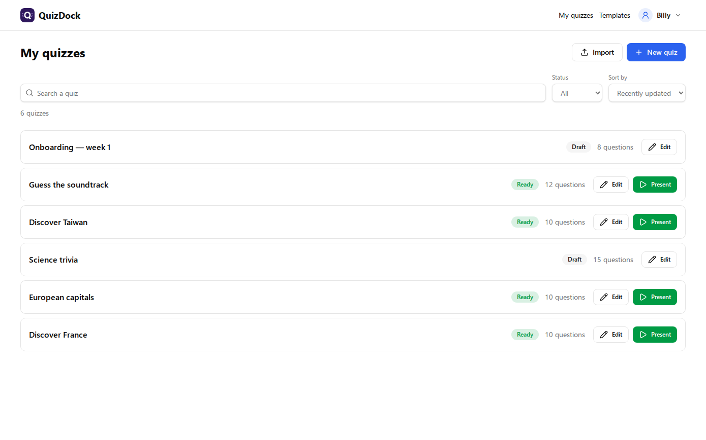 <b>My quizzes</b> — your bank: search, filter, import / export, one click to present | 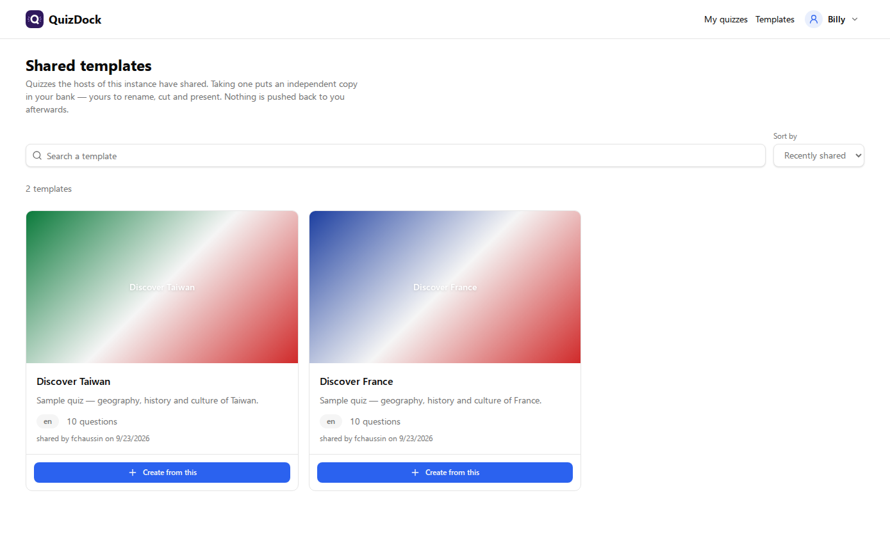 <b>Templates</b> — quizzes shared on the instance; take an independent copy |
| 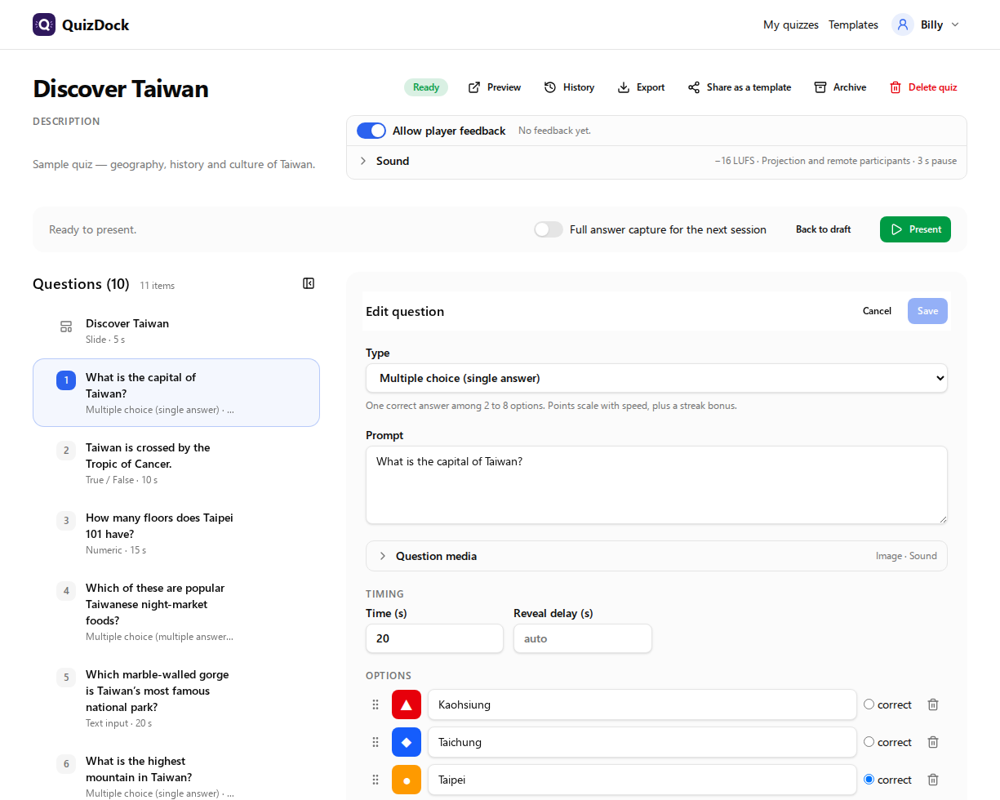 <b>Quiz builder</b> — a question's picture with its alternative text and credit; 7 question types, video &amp; sound, slides | 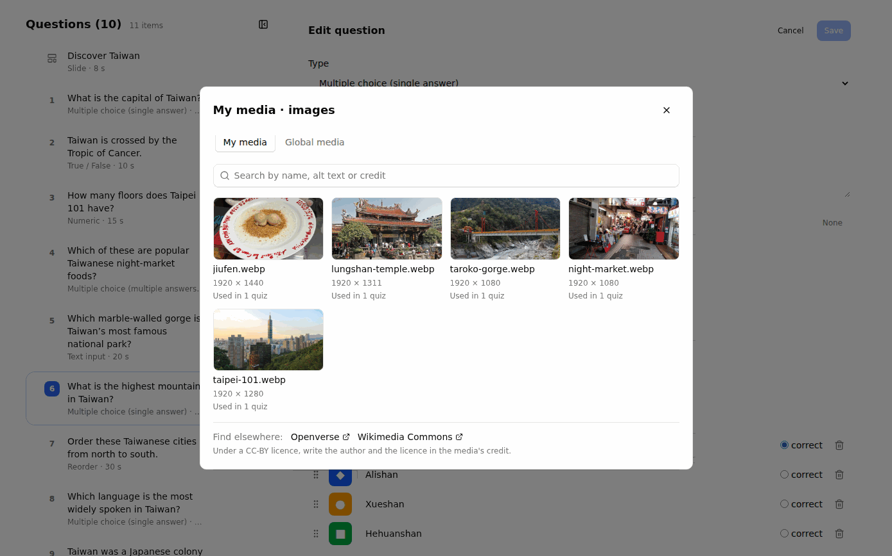 <b>My media</b> — reuse what you uploaded, with sizes and usages; links to free libraries |
| 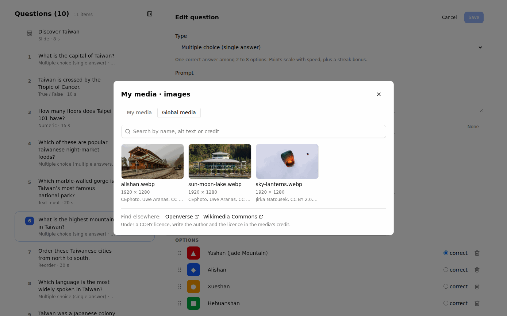 <b>Global media</b> — what the instance provides to every host, credited | 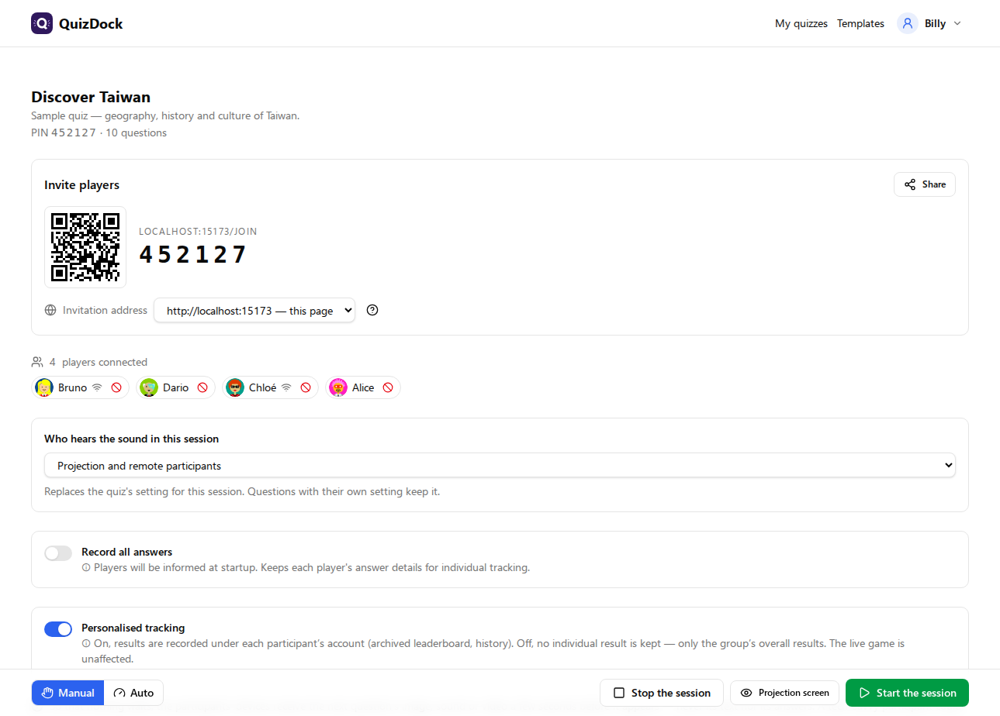 <b>Host console</b> — lobby: PIN, QR code, players in the room or remote, who hears the sound |
| 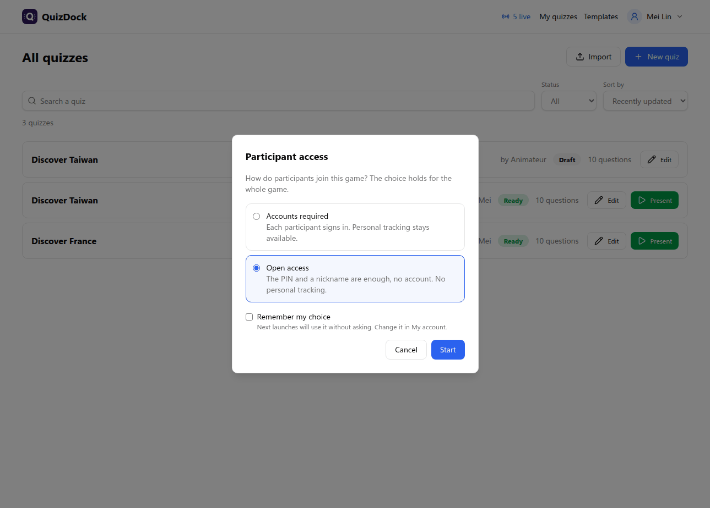 <b>Participant access</b> <i>(OIDC)</i> — accounts required or open access, chosen at launch for the whole game; <i>Remember my choice</i> skips the question | 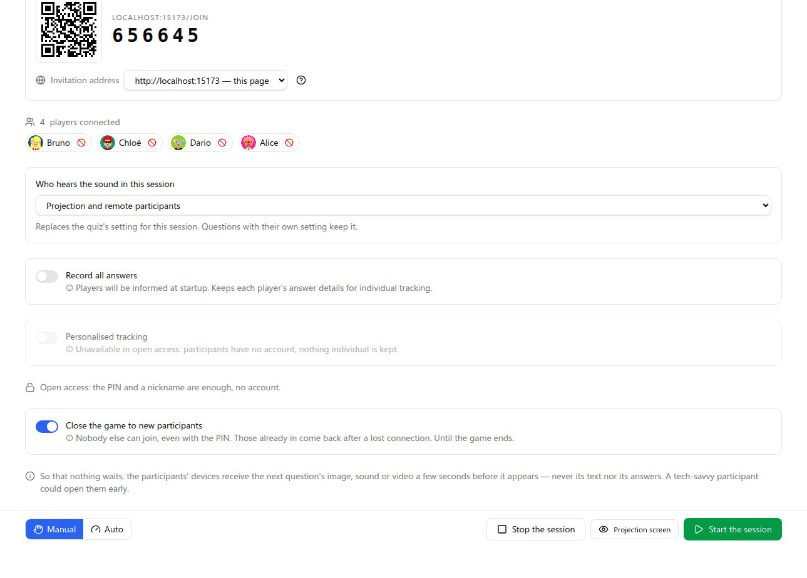 <b>Open access</b> — PIN and nickname, personal tracking greyed out; the game closed to new participants |
|  <b>Projection</b> — the big screen while players join | 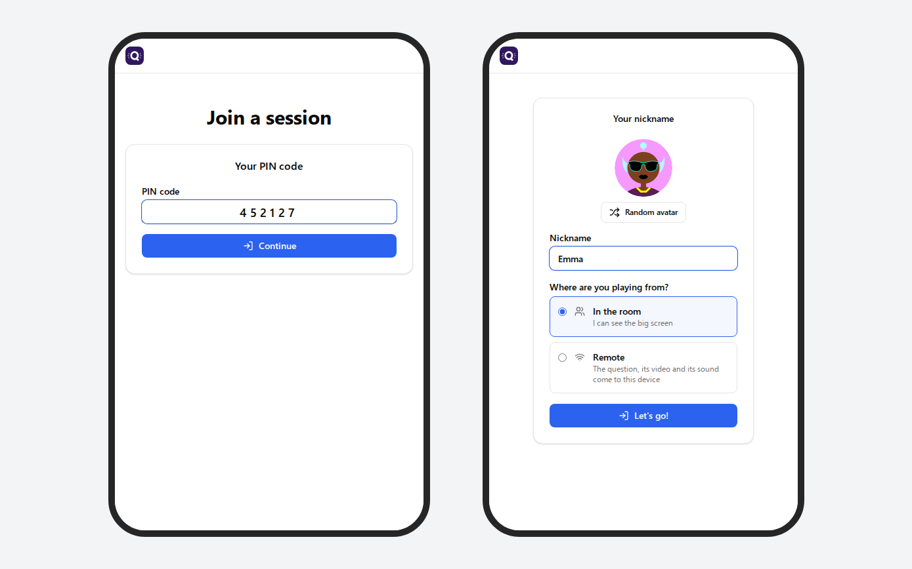 <b>Join</b> — PIN or QR code, nickname &amp; Multiavatar avatar, in the room or remote, no account |
|  <b>Content slide</b> — headings, text, images, backgrounds |  <b>Projection</b> — live question, Kahoot-style |
| 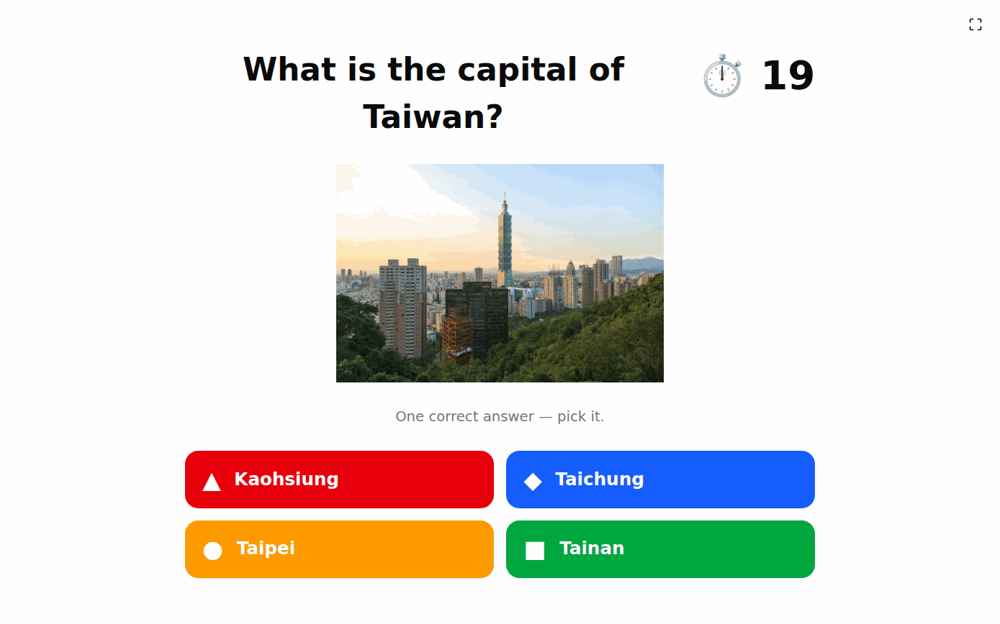 <b>Projection</b> — a question with its picture on the big screen |   |
| 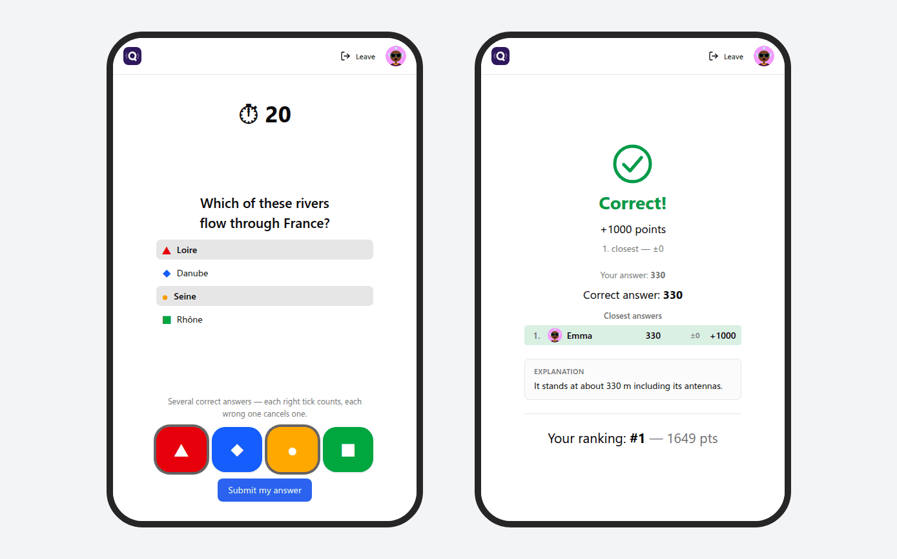 <b>Player</b> — answers listed, colour tiles to tap, then own result |  <b>Host console</b> — chrono, answers received, reveal now |
|  <b>Reveal</b> — distribution, explanation, live leaderboard |  <b>Host console</b> — look back over played questions, next |
|  <b>Player</b> — drag-and-drop ordering, rate the quiz at the end |   |
|  <b>Podium</b> — final results on the big screen | |
| 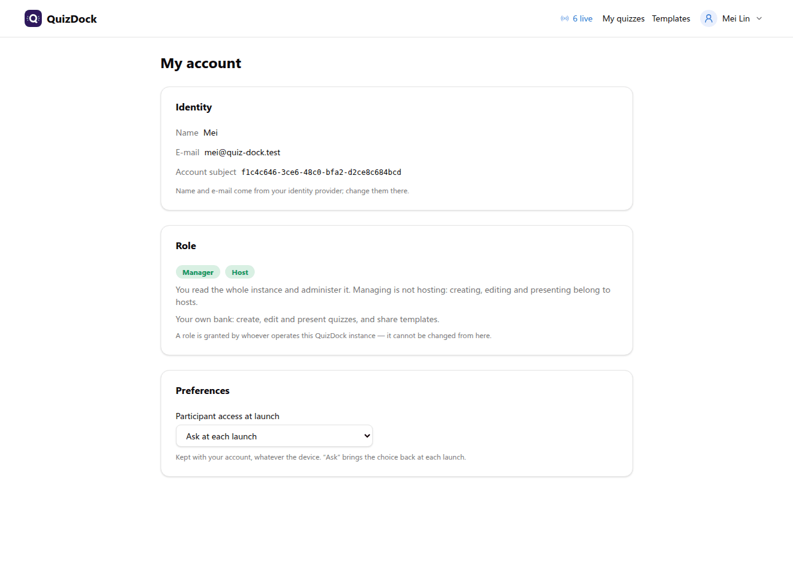 <b>My account</b> — identity, roles, and the preferences kept with the account (participant access at launch) |   |
| 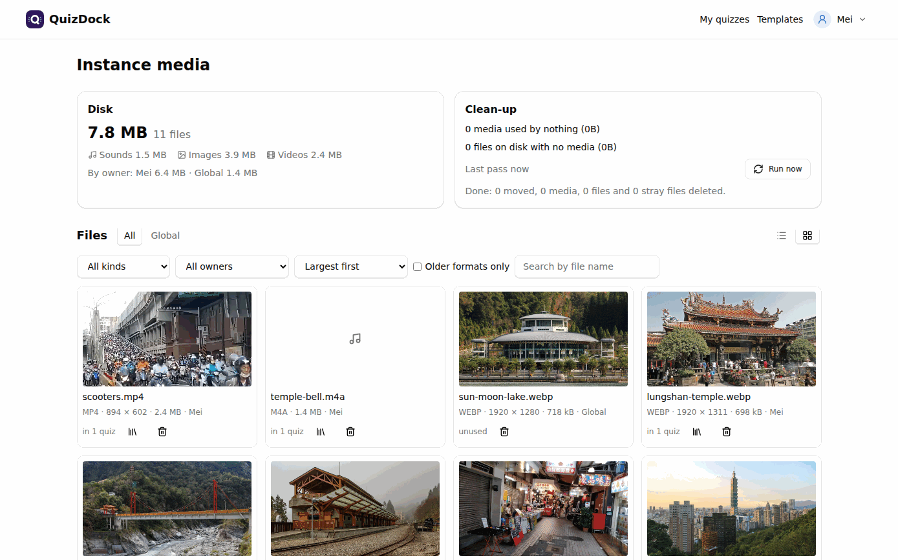 <b>Instance media</b> — disk by kind and owner, clean-up, every file as a grid or a list | 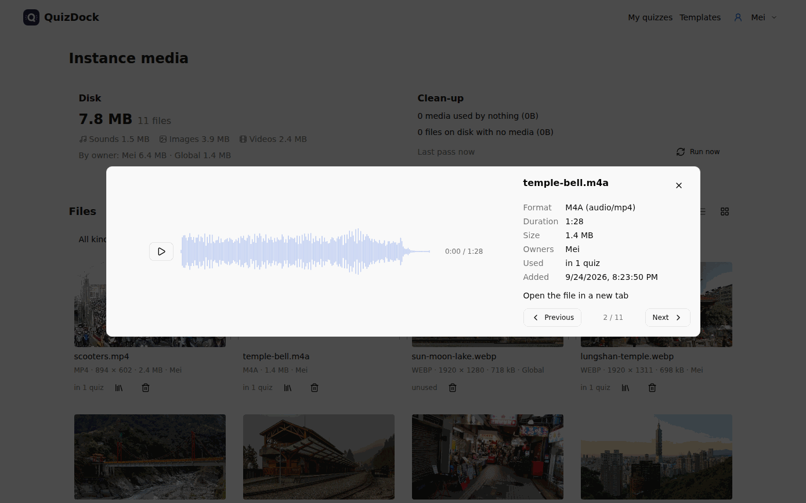 <b>Preview</b> — a sound on its waveform, with its format, length, owners and usages |
