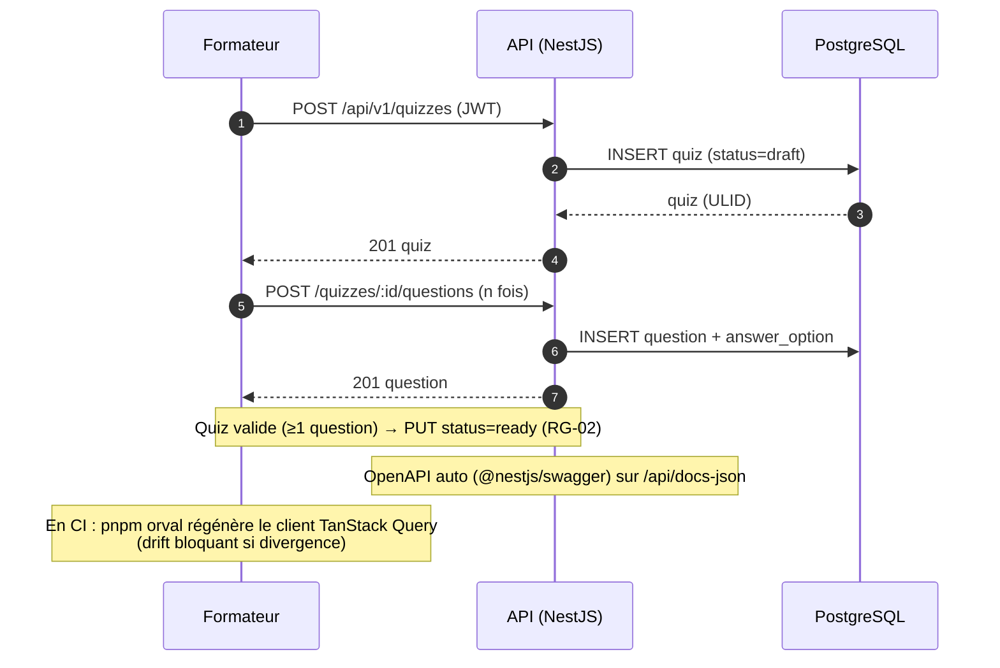
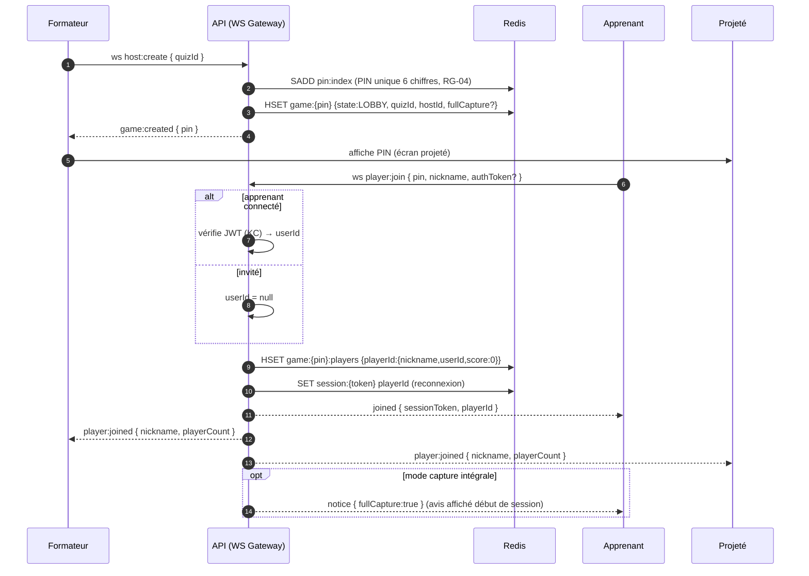
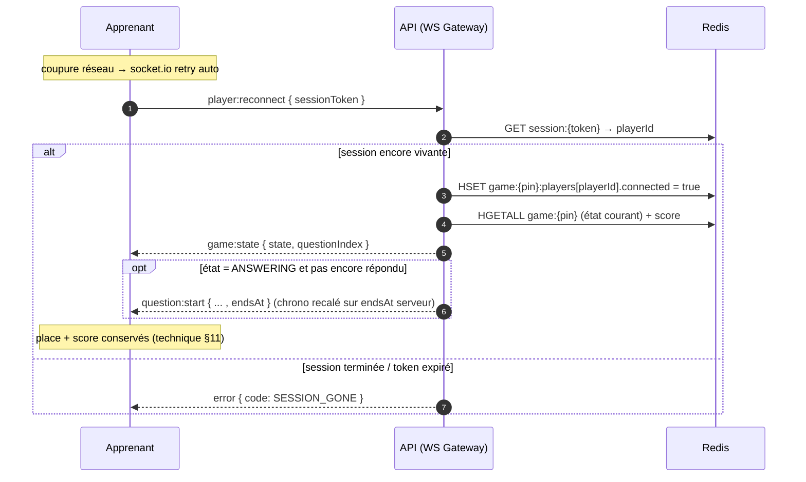
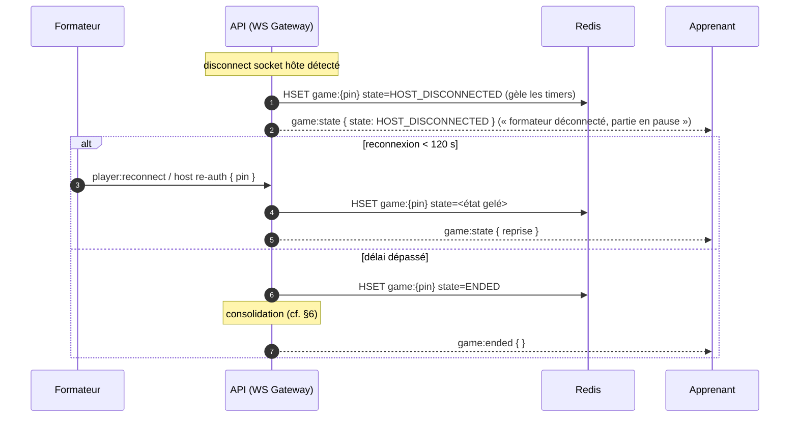
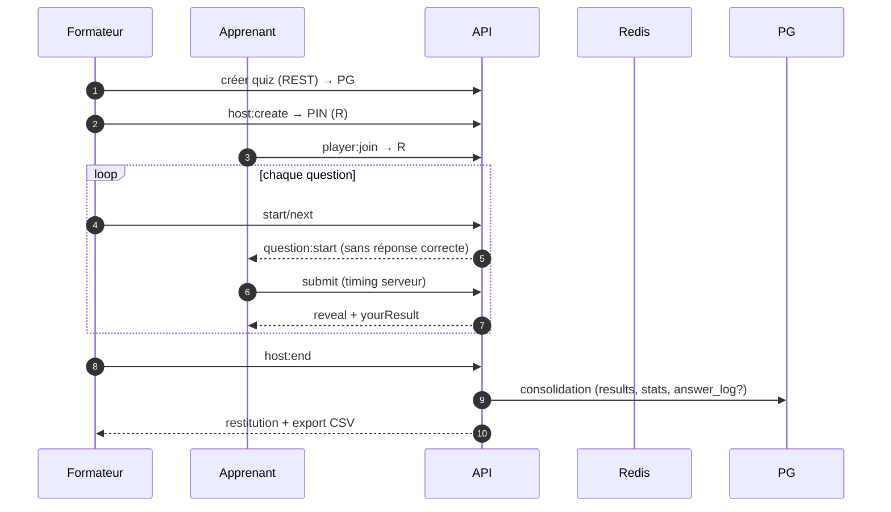

# Live-Quizz — Diagrammes de séquence

> Déroulé **dynamique** des interactions (Mermaid). Complète `SPECIFICATIONS.md` (§8 machine à états, §9 events WS, §6 timing, §11 reconnexion) et `SPECIFICATIONS-DONNEES.md`.
> Version 1.0 — 2026-06-09.

Acteurs / composants :
- **Apprenant** : client mobile (`socket.io-client`).
- **Formateur** : console desktop (REST + WS).
- **Projeté** : écran de jeu (lecture seule WS).
- **API** : backend NestJS (REST + WS Gateways).
- **Redis** : état live (source de vérité pendant la partie).
- **PG** : PostgreSQL (persistance durable).
- **KC** : fournisseur OIDC (Keycloak en référence, si `AUTH_MODE=oidc`).

---

## 1. Création de quiz & synchro de contrat (REST / Orval)



---

## 2. Lancement d'une session & lobby



---

## 3. Déroulé d'une question (cœur — timing serveur, anti-triche)

```mermaid
sequenceDiagram
    autonumber
    participant F as Formateur
    participant API as API (WS Gateway)
    participant R as Redis
    participant A as Apprenant
    participant P as Projeté

    Note over A,API: au join, RTT mesuré (ping/pong) → latencyMs/2 (compensation)

    F->>API: host:start  (ou host:next)
    API->>R: HSET game:{pin} state=ANSWERING, questionStartedAt=Ts, questionEndsAt=Ts+limit
    par diffusion question (SANS bonne réponse)
        API-->>A: question:start { options(text,color,shape), timeLimitS, startedAt, endsAt }
        API-->>P: question:start { ... }
    end

    A->>API: player:submit { questionIndex, answer }
    API->>API: receivedAt=Ts2 ; t = Ts2 - questionStartedAt - latencyMs/2
    alt en délai et 1re réponse (RG-06)
        API->>API: isCorrect = validation serveur
        API->>API: points = scoring(t, T, correct, streak)  (technique §5)
        API->>R: HSET game:{pin}:answers:{qIdx} {playerId:{value,isCorrect,points,receivedAt}}
        API->>R: ZINCRBY game:{pin}:leaderboard points playerId
        API-->>A: answer:ack { accepted:true }
    else hors délai / doublon
        API-->>A: answer:ack { accepted:false, reason:late|duplicate }
    end
    API-->>F: answer:count { answered, total }

    alt timer écoulé OU tous ont répondu
        API->>R: HSET game:{pin} state=REVEAL
        API-->>A: question:reveal { correctOptionIds, yourResult:{correct,points,totalScore,rank} }
        API-->>P: question:reveal { correctOptionIds, distribution }
        API-->>F: question:reveal { distribution, leaderboard }
    end
    Note over F: REVEAL → LEADERBOARD → host:next (question suivante) ou PODIUM
```

---

## 4. Reconnexion d'un apprenant



---

## 5. Hôte déconnecté → pause → reprise/fin



---

## 6. Fin de session & consolidation Redis → PostgreSQL

```mermaid
sequenceDiagram
    autonumber
    participant F as Formateur
    participant API as API
    participant R as Redis
    participant PG as PostgreSQL

    F->>API: host:end { pin }  (ou dernière question atteinte)
    API->>R: HGETALL game:{pin}:players / :leaderboard / :answers:*
    API->>API: calcule classement final, stats par question, success_rate
    API->>PG: INSERT game_session_log (+ quiz_snapshot JSONB)
    API->>PG: INSERT player_result_log (1/apprenant, user_id si connecté)
    API->>PG: INSERT question_result_stat (1/question : taux, distribution)
    alt full_capture = true
        API->>PG: INSERT answer_log (1/réponse individuelle)
    end
    API->>R: DEL game:{pin}* ; SREM pin:index {pin}
    API-->>F: game:ended → restitution disponible
    Note over F: GET /sessions/:id/results(.csv) (REST, Orval)
```

---

## 7. Vue d'ensemble — cycle complet (résumé)



---

## 8. Notes de cohérence

- **Timing autoritatif** : tout `t` est calculé serveur (`receivedAt - questionStartedAt - latencyMs/2`), jamais côté client (technique §6).
- **Anti-triche** : `question:start` ne contient **jamais** la bonne réponse ; seul `question:reveal` la divulgue (technique §7).
- **Idempotence réponse** : une seule réponse comptée par `(playerId, questionIndex)` (RG-06).
- **Source de vérité** : Redis pendant la partie ; PostgreSQL après consolidation. Aucune écriture PG par réponse (sauf `answer_log` en fin de partie si capture intégrale).
- **Avis capture intégrale** : envoyé à l'apprenant au join si `fullCapture=true`, avant toute collecte.
