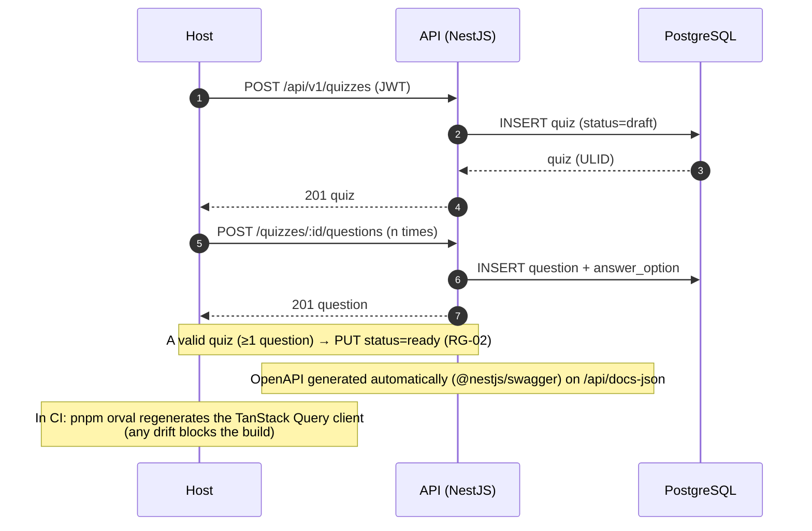
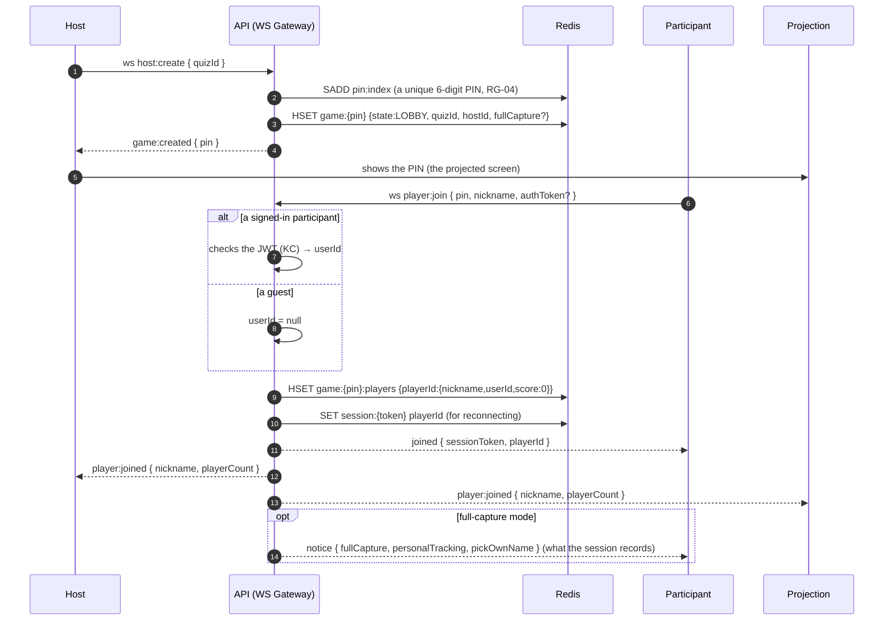
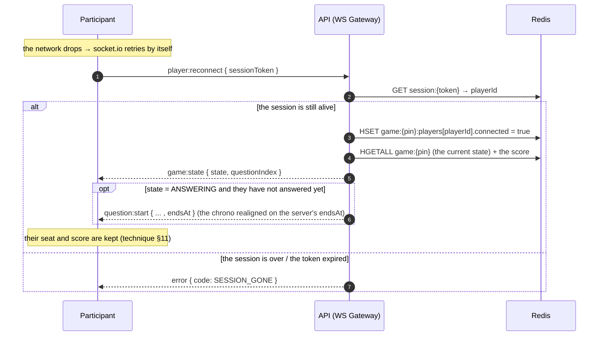
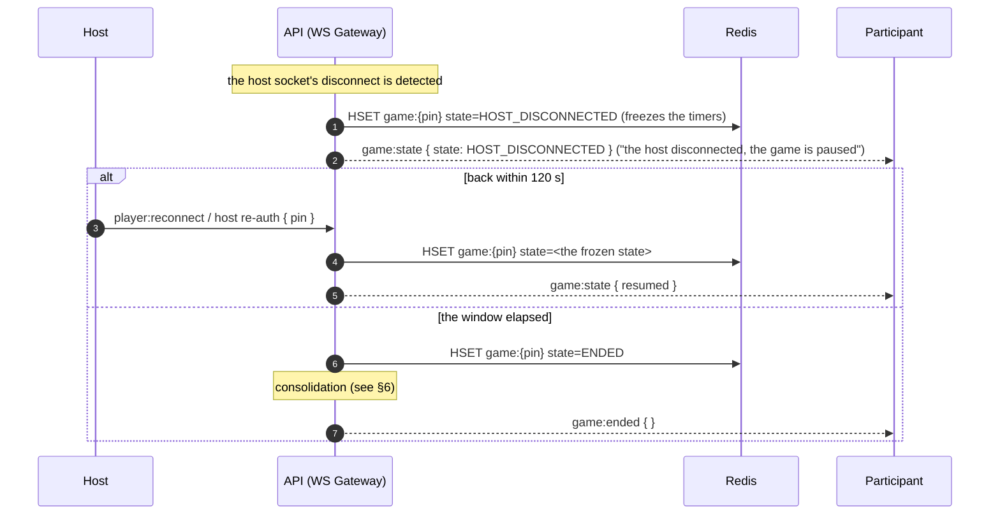
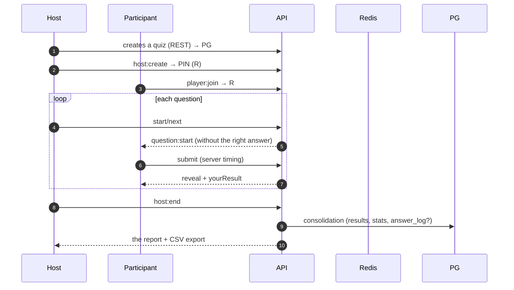

# QuizDock — Sequence diagrams

> The **dynamic** run of the interactions (Mermaid). It complements `SPECIFICATIONS.md` (§8 the state machine, §9 the WS events, §6 timing, §11 reconnecting) and `SPECIFICATIONS-DONNEES.md`.
> Version 1.0 — 2026-06-09.

Actors and components:
- **Participant**: the mobile client (`socket.io-client`).
- **Host**: the desktop console (REST + WS).
- **Projection**: the game screen (read-only over WS).
- **API**: the NestJS backend (REST + WS gateways).
- **Redis**: the live state (the source of truth while the game runs).
- **PG**: PostgreSQL (durable persistence).
- **KC**: the OIDC provider (Keycloak as the reference, when `AUTH_MODE=oidc`).

---

## 1. Creating a quiz & syncing the contract (REST / Orval)

```mermaid
sequenceDiagram
    autonumber
    participant F as Host
    participant API as API (NestJS)
    participant PG as PostgreSQL
    F->>API: POST /api/v1/quizzes (JWT)
    API->>PG: INSERT quiz (status=draft)
    PG-->>API: quiz (ULID)
    API-->>F: 201 quiz
    F->>API: POST /quizzes/:id/questions (n times)
    API->>PG: INSERT question + answer_option
    API-->>F: 201 question
    Note over F,API: A valid quiz (≥1 question) → PUT status=ready (RG-02)
    Note over API: OpenAPI generated automatically (@nestjs/swagger) on /api/docs-json
    Note over F: In CI: pnpm orval regenerates the TanStack Query client<br/>(any drift blocks the build)
```

---

## 2. Starting a session & the lobby

```mermaid
sequenceDiagram
    autonumber
    participant F as Host
    participant API as API (WS Gateway)
    participant R as Redis
    participant A as Participant
    participant P as Projection

    F->>API: ws host:create { quizId }
    API->>R: SADD pin:index (a unique 6-digit PIN, RG-04)
    API->>R: HSET game:{pin} {state:LOBBY, quizId, hostId, fullCapture?}
    API-->>F: game:created { pin }
    F->>P: shows the PIN (the projected screen)

    A->>API: ws player:join { pin, nickname, authToken? }
    alt a signed-in participant
        API->>API: checks the JWT (KC) → userId
    else a guest
        API->>API: userId = null
    end
    API->>R: HSET game:{pin}:players {playerId:{nickname,userId,score:0}}
    API->>R: SET session:{token} playerId (for reconnecting)
    API-->>A: joined { sessionToken, playerId }
    API-->>F: player:joined { nickname, playerCount }
    API-->>P: player:joined { nickname, playerCount }
    opt full-capture mode
        API-->>A: notice { fullCapture, personalTracking, pickOwnName } (what the session records)
    end
```

---

## 3. One question, end to end (the core — server timing, anti-cheat)

```mermaid
sequenceDiagram
    autonumber
    participant F as Host
    participant API as API (WS Gateway)
    participant R as Redis
    participant A as Participant
    participant P as Projection

    Note over A,API: on joining, the RTT is measured (ping/pong) → latencyMs/2 (compensation)

    F->>API: host:start  (or host:next)
    API->>R: HSET game:{pin} state=ANSWERING, questionStartedAt=Ts, questionEndsAt=Ts+limit
    par the question goes out (WITHOUT the right answer)
        API-->>A: question:start { options(text,color,shape), timeLimitS, startedAt, endsAt }
        API-->>P: question:start { ... }
    end

    A->>API: player:submit { questionIndex, answer }
    API->>API: receivedAt=Ts2 ; t = Ts2 - questionStartedAt - latencyMs/2
    alt in time and the first answer (RG-06)
        API->>API: isCorrect = validated on the server
        API->>API: points = scoring(t, T, correct, streak)  (technique §5)
        API->>R: HSET game:{pin}:answers:{qIdx} {playerId:{value,isCorrect,points,receivedAt}}
        API->>R: ZINCRBY game:{pin}:leaderboard points playerId
        API-->>A: answer:ack { accepted:true }
    else late / duplicate
        API-->>A: answer:ack { accepted:false, reason:late|duplicate }
    end
    API-->>F: answer:count { answered, total }

    alt the timer elapsed OR everyone answered
        API->>R: HSET game:{pin} state=REVEAL
        API-->>A: question:reveal { correctOptionIds, yourResult:{correct,points,totalScore,rank} }
        API-->>P: question:reveal { correctOptionIds, distribution }
        API-->>F: question:reveal { distribution, leaderboard }
    end
    Note over F: REVEAL → LEADERBOARD → host:next (the next question) or PODIUM
```

---

## 4. A participant reconnects

```mermaid
sequenceDiagram
    autonumber
    participant A as Participant
    participant API as API (WS Gateway)
    participant R as Redis

    Note over A: the network drops → socket.io retries by itself
    A->>API: player:reconnect { sessionToken }
    API->>R: GET session:{token} → playerId
    alt the session is still alive
        API->>R: HSET game:{pin}:players[playerId].connected = true
        API->>R: HGETALL game:{pin} (the current state) + the score
        API-->>A: game:state { state, questionIndex }
        opt state = ANSWERING and they have not answered yet
            API-->>A: question:start { ... , endsAt }  (the chrono realigned on the server's endsAt)
        end
        Note over A: their seat and score are kept (technique §11)
    else the session is over / the token expired
        API-->>A: error { code: SESSION_GONE }
    end
```

---

## 5. The host disconnects → pause → resume or end

```mermaid
sequenceDiagram
    autonumber
    participant F as Host
    participant API as API (WS Gateway)
    participant R as Redis
    participant A as Participant

    Note over API: the host socket's disconnect is detected
    API->>R: HSET game:{pin} state=HOST_DISCONNECTED (freezes the timers)
    API-->>A: game:state { state: HOST_DISCONNECTED }  ("the host disconnected, the game is paused")
    alt back within 120 s
        F->>API: player:reconnect / host re-auth { pin }
        API->>R: HSET game:{pin} state=<the frozen state>
        API-->>A: game:state { resumed }
    else the window elapsed
        API->>R: HSET game:{pin} state=ENDED
        Note over API: consolidation (see §6)
        API-->>A: game:ended { }
    end
```

---

## 6. End of session & consolidation from Redis into PostgreSQL

```mermaid
sequenceDiagram
    autonumber
    participant F as Host
    participant API as API
    participant R as Redis
    participant PG as PostgreSQL

    F->>API: host:end { pin }  (or the last question was reached)
    API->>R: HGETALL game:{pin}:players / :leaderboard / :answers:*
    API->>API: computes the final leaderboard, per-question stats, success_rate
    API->>PG: INSERT game_session_log (+ quiz_snapshot JSONB)
    API->>PG: INSERT player_result_log (one per participant, user_id when signed in)
    API->>PG: INSERT question_result_stat (one per question: rate, distribution)
    alt full_capture = true
        API->>PG: INSERT answer_log (one per individual answer)
    end
    API->>R: DEL game:{pin}* ; SREM pin:index {pin}
    API-->>F: game:ended → the report is available
    Note over F: GET /sessions/:id/results(.csv) (REST, Orval)
```

---

## 7. Overview — the full cycle (summary)

```mermaid
sequenceDiagram
    autonumber
    participant F as Host
    participant A as Participant
    participant API as API
    participant R as Redis
    participant PG as PG

    F->>API: creates a quiz (REST) → PG
    F->>API: host:create → PIN (R)
    A->>API: player:join → R
    loop each question
        F->>API: start/next
        API-->>A: question:start (without the right answer)
        A->>API: submit (server timing)
        API-->>A: reveal + yourResult
    end
    F->>API: host:end
    API->>PG: consolidation (results, stats, answer_log?)
    API-->>F: the report + CSV export
```

---

## 8. Consistency notes

- **Authoritative timing**: every `t` is computed on the server (`receivedAt - questionStartedAt - latencyMs/2`), never on the client (technique §6).
- **Anti-cheat**: `question:start` **never** carries the right answer; only `question:reveal` discloses it (technique §7).
- **Answer idempotence**: one answer counted per `(playerId, questionIndex)` (RG-06).
- **Source of truth**: Redis while the game runs; PostgreSQL after consolidation. No PG write per answer (except `answer_log` at the end of the game, under full capture).
- **The notice**: sent to the participant on joining, before anything is collected; its wording follows `personalTracking` and `fullCapture` (RG-16).
